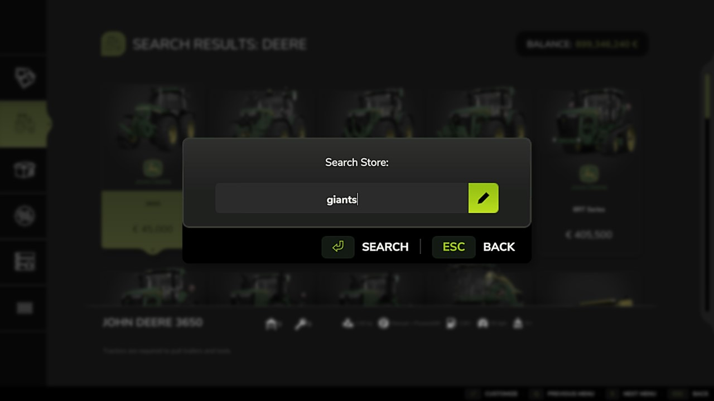

# STORE SEARCH
[Download](https://www.farming-simulator.com/mod.php?mod_id=310641&title=fs2025)

Adds a search function to the in-game store. Pressing the F key (configurable) when the store menu is open will display a search dialog.

The search function supports the following fields
- Equipment name (e.g. 'Vario')
- Brand name (e.g. 'Massey')
- Mod name (e.g. 'Allis')
- Mod author (e.g. 'Giants')

## [Want to report a bug or have a great idea?](https://github.com/w33zl/FS25_EnhancedShopSorting/issues/new/choose)
If you want to report a bug or submit an suggestion, please first check the [list of existing issues]() to ensure that you are not adding duplicates (this just consumes my time that could be spent on improving the mods). When you have ensured that your issue is not already reported, you can create a [bug report](https://github.com/w33zl/FS25_EnhancedShopSorting/issues/new?template=bug_report.md) or a [feature request](https://github.com/w33zl/FS25_EnhancedShopSorting/issues/new?template=feature_request.md).

## [Download](https://www.farming-simulator.com/mod.php?mod_id=310641&title=fs2025)

* Download [Store Search](https://www.farming-simulator.com/mod.php?mod_id=310641&title=fs2025)
* Download [Enhanced Shop Sorting](https://www.farming-simulator.com/mod.php?mod_id=310638&title=fs2025)

To download my other mods, please visit my FS19, FS22 or FS25 page on the official Giants ModHub page:

## Like the work I do?
I love to hear you feedback so please check out my [Facebook](https://www.facebook.com/w33zl). If you want to support me you can become my [Patron](https://www.patreon.com/wzlmodding) or buy me a [Ko-fi](https://ko-fi.com/w33zl) :heart:

> _By interacting with me and supporting me on these platforms, you help me stay motivated to create new mods and make the publicly available. Any monetary support also helps me towards my dream; to spend more time on making mods for Farming Simulator instead of my current day job (as everyone else, I need to finance my IRL life some way or other)._

 

